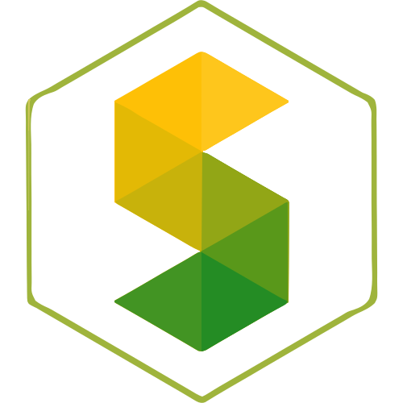

<!-- Don't delete it -->
<div name="readme-top"></div>

<!-- Organization Logo -->
<div align="center" style="display: flex; align-items: center; justify-content: center; gap: 16px;">
  
  
</div>

&nbsp;

<!-- Organization Name -->
<div align="center">

[](https://TODO.stability.nexus/)

<!-- Correct deployed url to be added -->

</div>

<!-- Organization/Project Social Handles -->
<p align="center">
<!-- Telegram -->
<a href="https://t.me/StabilityNexus">
</a>
&nbsp;&nbsp;
<!-- X (formerly Twitter) -->
<a href="https://x.com/StabilityNexus">
</a>
&nbsp;&nbsp;
<!-- Discord -->
<a href="https://discord.gg/YzDKeEfWtS">
</a>
&nbsp;&nbsp;
<!-- Medium -->
<a href="https://news.stability.nexus/">
  </a>
&nbsp;&nbsp;
<!-- LinkedIn -->
<a href="https://linkedin.com/company/stability-nexus">
  </a>
&nbsp;&nbsp;
<!-- Youtube -->
<a href="https://www.youtube.com/@StabilityNexus">
  </a>
</p>

---

<div align="center">
<h1>TODO: Project Name</h1>
</div>

[TODO](https://TODO.stability.nexus/) is a ... TODO: Project Description.

---

## Tech Stack

**Frontend**

* Next.js v14 (React 18 + TypeScript)
* Tailwind CSS (v4) with tailwindcss-animate
* shadcn/ui (Radix primitives + component library)

**Web3 / Blockchain**

* RainbowKit (wallet UI)
* Wagmi (connectors + hooks)
* Viem (Ethereum client)
* Solidity smart contracts (back end)

**State & Forms**

* TanStack React Query (data fetching)
* React Hook Form + Zod (form validation)

**Other**

* GSAP (animations)
* Recharts (charts)
* Lucide React (icons), Sonner (toasts), date-fns, clsx, tailwind-merge, etc.

---

## Getting Started

## Requirements

* Node.js 18+
* npm / yarn / pnpm
* A browser wallet extension (MetaMask or compatible) for local interactions

## Quickstart — Local Development

1. **Clone the repository**

```bash
git clone https://github.com/StabilityNexus/OrbOracle-EVM-Frontend.git
cd OrbOracle-EVM-Frontend
```

2. **Install dependencies**

```bash
npm install
# or
# yarn install
# or
# pnpm install
```

3. **Environment variables**

Create a `.env.local` in the project root and add required values. Minimal example used by the frontend:

```env
NEXT_PUBLIC_PROJECT_ID=your_walletconnect_project_id_here
# Add any additional env vars your local setup requires
```

> **How to get a WalletConnect Project ID**: create a project at [https://cloud.walletconnect.com](https://cloud.walletconnect.com) and copy the `projectId` into `NEXT_PUBLIC_PROJECT_ID`. RainbowKit requires this for WalletConnect v2.

4. **Start the dev server**

```bash
npm run dev
# or
# yarn dev
# or
# pnpm dev
```

Open [http://localhost:3000](http://localhost:3000)

---

## Contributing

We welcome contributions of all kinds! To contribute:

1. Fork the repository and create your feature branch (`git checkout -b feature/AmazingFeature`).
2. Commit your changes (`git commit -m 'Add some AmazingFeature'`).
3. Run the development workflow commands to ensure code quality:
   - `npm run format:write`
   - `npm run lint:fix`
   - `npm run typecheck`
4. Push your branch (`git push origin feature/AmazingFeature`).
5. Open a Pull Request for review.

If you encounter bugs, need help, or have feature requests:

- Please open an issue in this repository providing detailed information.
- Describe the problem clearly and include any relevant logs or screenshots.

We appreciate your feedback and contributions!

© 2025 The Stable Order.
