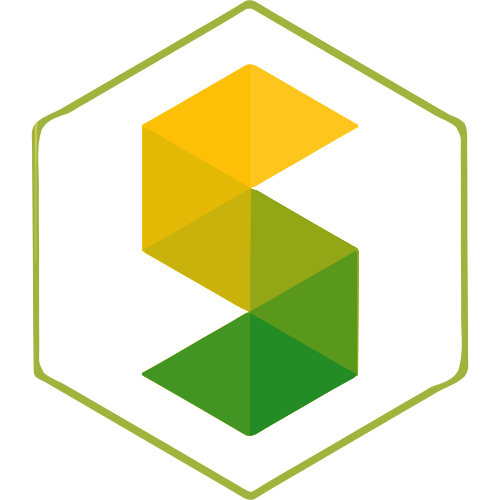

<!-- Don't delete it -->
<div name="readme-top"></div>

<!-- Organization Logo -->
<div align="center" style="display: flex; align-items: center; justify-content: center; gap: 16px;">
  
</div>

&nbsp;

<!-- Organization Name -->
<div align="center">

[](https://stability.nexus/)
[](https://scorecard.dev/viewer/?uri=github.com/StabilityNexus/OrbOracle-EVM-Frontend)

</div>

<!-- Organization/Project Social Handles -->
<p align="center">
<!-- Telegram -->
<a href="https://t.me/StabilityNexus">
</a>
&nbsp;&nbsp;
<!-- X (formerly Twitter) -->
<a href="https://x.com/StabilityNexus">
</a>
&nbsp;&nbsp;
<!-- Discord -->
<a href="https://discord.gg/YzDKeEfWtS">
</a>
&nbsp;&nbsp;
<!-- Medium -->
<a href="https://news.stability.nexus/">
  </a>
&nbsp;&nbsp;
<!-- LinkedIn -->
<a href="https://linkedin.com/company/stability-nexus">
  </a>
&nbsp;&nbsp;
<!-- Youtube -->
<a href="https://www.youtube.com/@StabilityNexus">
  </a>
</p>

---

<div align="center">
<h1>Orb Oracle EVM Frontend</h1>
</div>

The decentralized user interface for the Orb Oracle protocol. It allows users to browse active data feeds, submit price values to base oracles (governance-backed), deploy new base or composed oracle instances, and monitor time-weighted price intervals directly on-chain.

---

## Tech Stack

### Frontend
- **Next.js 14+** (React App Router)
- **TypeScript**
- **Tailwind CSS v4**
- **shadcn/ui** components
- **GSAP** (Smooth animations and layout transitions)

### Blockchain Integration
- **Wagmi & Viem** for type-safe EVM interactions
- **RainbowKit** for wallet connections
- **Solidity Smart Contracts** (via factory configurations)

---

## Getting Started

### Prerequisites

- **Node.js 18+** installed on your system
- A package manager (**npm**, **yarn**, or **pnpm**)
- A Web3 wallet browser extension (e.g. MetaMask, Rabby) connected to Ethereum Sepolia Testnet

### Installation

#### 1. Clone the Repository

```bash
git clone https://github.com/YOUR_USERNAME/OrbOracle-EVM-Frontend.git
cd OrbOracle-EVM-Frontend
```

#### 2. Install Dependencies

Using your preferred package manager:

```bash
npm install
```

#### 3. Run the Development Server

Start the app locally:

```bash
npm run dev
```

#### 4. Open your Browser

Navigate to [http://localhost:3000](http://localhost:3000) to see the application.

---

## Contributing

We welcome contributions of all kinds! Please refer to our [CONTRIBUTING.md](CONTRIBUTING.md) for full setup instructions, Git workflow guidelines, and code quality standards.

If you encounter bugs, need help, or have feature requests:
- Please open an issue in this repository providing detailed information.
- Describe the problem clearly and include any relevant logs or screenshots.

We appreciate your feedback and contributions!

© 2026 The Stable Order.
